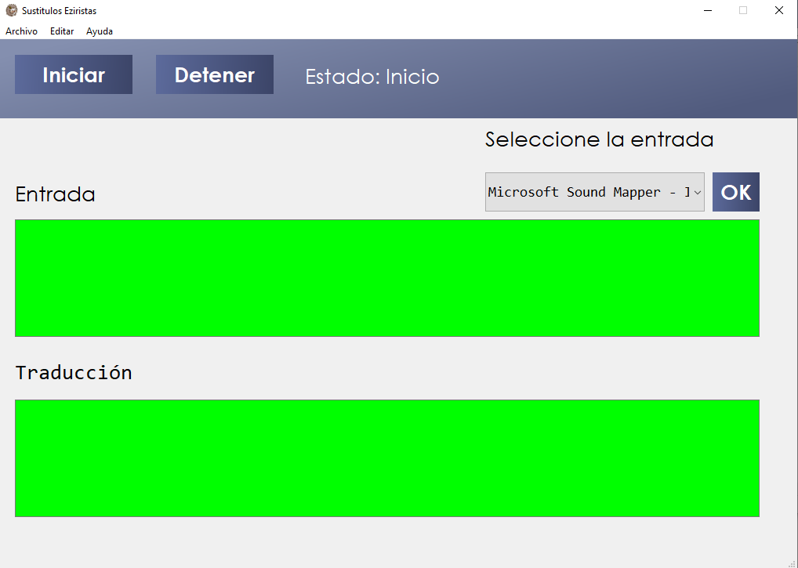

# SubtitleGenerator4Streaming

Este proyecto implementa modelos de reconocimiento automático de voz (**Speech-to-Text**) para generar subtítulos en tiempo real a partir del audio capturado por el micrófono principal del sistema, implementando modelos de traducción de texto. Está pensado para aplicaciones de streaming, conferencias en vivo, clases virtuales o cualquier entorno donde se requiera accesibilidad mediante subtítulos automáticos.

Por requerimiento se configuró de manera predeterminada la traduccion de español a inglés, pero se puede cambiar entre varios idiomas
Adicionalmente tiene la capacidad de censurar palabras preasignadas en un archivo txt

This project implements automatic speech recognition (Speech-to-Text) models to generate real-time subtitles from audio captured by the system's main microphone, implementing text translation models. It is designed for streaming applications, live conferences, virtual classrooms, or any environment where accessibility through automatic subtitles is required.

By request, the translation from Spanish to English was configured by default, but it can be changed between several languages.
Additionally, it has the ability to censor pre-assigned words in a txt file.

---

##  Contenido del proyecto

- Reconoce palabras y las convierte a texto
- Realiza la traducción entre idiomas
- Muestra el resultado en pantalla



## Requisitos

- Python 3.10 (Recomendado)

### Instalación de librerías (si no las tienes)

```bash
pip install -r requirements.txt
